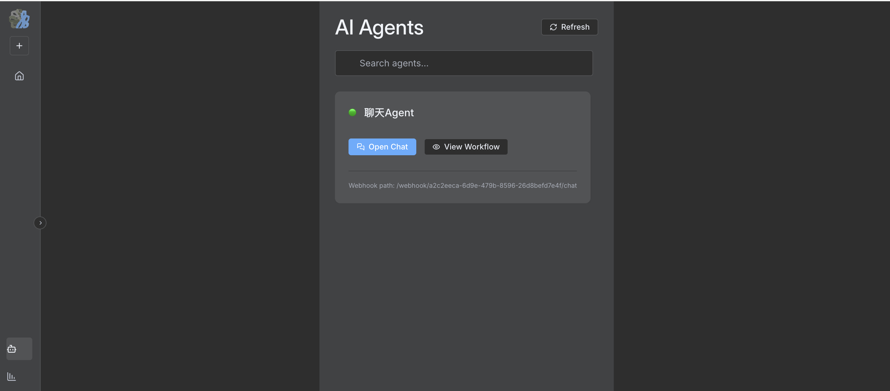
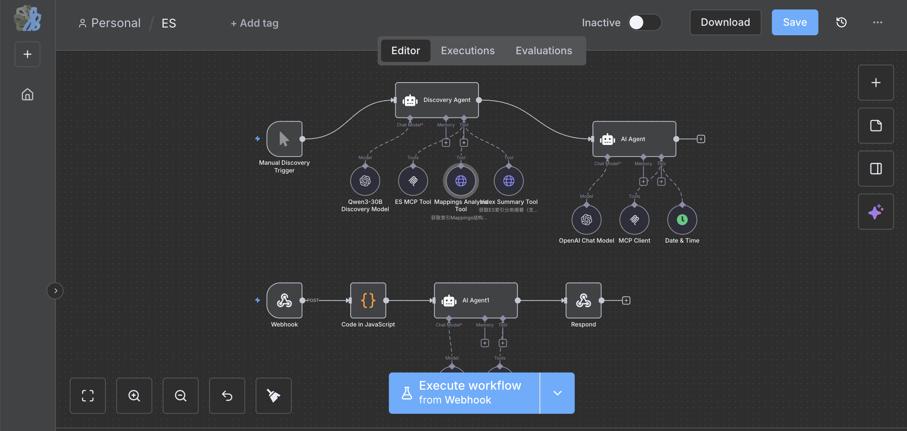

# NewFlow

English | [简体中文](./README.zh-CN.md) | [Official Website](https://newflow.ee)

**AI-First Workflow Automation Platform**

NewFlow is a community-driven fork of n8n, enhanced with advanced AI agent orchestration, built-in MCP runtime, and intelligent automation capabilities. Built for teams who need powerful, self-hosted workflow automation with cutting-edge AI features.

## 📸 Screenshots

### AI Agent Workflow


### NewFlow Workflow Editor


## ✨ Key Features

### 🤖 Advanced AI Agent Orchestration
- Native support for multiple LLM providers (OpenAI, Mistral, Perplexity, DeepSeek)
- Multi-agent collaboration workflows
- Context-aware decision making
- Built-in prompt engineering tools

### 🆓 Free AI Code Generation
- **AI-powered node development** - Generate custom nodes with natural language
- Automatic workflow suggestion and optimization
- Intelligent error detection and resolution
- Code explanation and documentation generation

### 🔌 Built-in MCP Runtime
- Integrated MCP (Model Context Protocol) server runtime
- Run MCP servers directly within workflows without external setup
- Pre-configured MCP integrations for common AI tools
- Simplified context sharing across AI agents

### 📊 Elasticsearch Analysis Agent
- Specialized agents for log analysis and investigation
- Root cause analysis automation
- Security event correlation
- Performance monitoring and alerting

### 🛠️ Visual Workflow Builder
- Intuitive drag-and-drop interface
- 80+ pre-built integration nodes
- Real-time execution monitoring
- Custom JavaScript/Python code execution

### 🔒 Enterprise-Ready
- Self-hosted deployment (full data control)
- Docker and Docker Compose support
- Queue mode for high-volume processing
- Webhook and REST API support

## 🚀 Quick Start

### Using Docker (Recommended)

```bash
docker run -d \
  --name newflow \
  -p 5678:5678 \
  -v ~/.newflow:/home/node/.newflow \
  newflow/newflow:latest
```

Access NewFlow at `http://localhost:5678`

### Using Docker Compose

```bash
# Clone the repository
git clone https://github.com/yourusername/newflow.git
cd newflow

# Start with Docker Compose
docker-compose up -d
```

### Manual Installation

**Requirements:** Node.js 18+ and pnpm

```bash
# Install dependencies
pnpm install

# Build the project
pnpm build

# Start NewFlow
pnpm start
```

## 📖 Core Use Cases

### AI-Powered Log Analysis
Webhook → Elasticsearch Query → AI Agent Analysis → Root Cause Report → Slack Notification

### Automated Security Investigation
Security Alert → Multi-Agent Investigation → Context Gathering → Threat Assessment → Response Actions

### Intelligent Data Pipeline
Cron Schedule → Data Extraction → AI-Driven Transformation → Database Storage → Quality Validation

### Code Generation Workflow
Natural Language Input → AI Code Generator → Validation → Git Commit → Deployment

## 🎯 Why NewFlow?

| Feature | NewFlow | Standard n8n |
|---------|---------|--------------|
| AI Agent Orchestration | ✅ Enhanced | ⚠️ Basic |
| Free AI Code Generation | ✅ Included | ❌ Not Available |
| Built-in MCP Runtime | ✅ Integrated | ⚠️ Manual Setup |
| Elasticsearch Agents | ✅ Specialized | ⚠️ Generic |
| Self-Hosted | ✅ 100% | ✅ Yes |
| Open Source | ✅ Community Fork | ✅ Yes |

## 🛡️ License

NewFlow is licensed under the **Sustainable Use License (SUL)** - free for internal business use, non-commercial purposes, and personal projects. All AI features and agent capabilities are included at no cost.

**Key Points:**
- ✅ Use for your own internal business operations (any size organization)
- ✅ Modify and customize for your needs
- ✅ Non-commercial and personal use
- ❌ Cannot sell the software itself as a commercial product
- ❌ Cannot distribute as paid SaaS offering

For commercial distribution or enterprise support, please contact the community maintainers.

## 🤝 Contributing

NewFlow is a community-driven project. We welcome contributions from developers worldwide:

- Report bugs and request features via GitHub Issues
- Submit pull requests for improvements
- Share your custom nodes and workflows
- Join discussions and help other users

## 🔗 Resources

- **Official Website**: [https://newflow.ee](https://newflow.ee)
- **Documentation**: Coming soon
- **Workflow Templates**: `/workflow_template` directory
- **Docker Images**: Available on Docker Hub
- **Community Support**: GitHub Discussions

## 🙏 Acknowledgments

NewFlow is built upon the excellent foundation of [n8n](https://github.com/n8n-io/n8n). We maintain full compatibility with n8n workflows while adding community-requested AI and automation enhancements.

---

**Built with ❤️ by the NewFlow Community**

